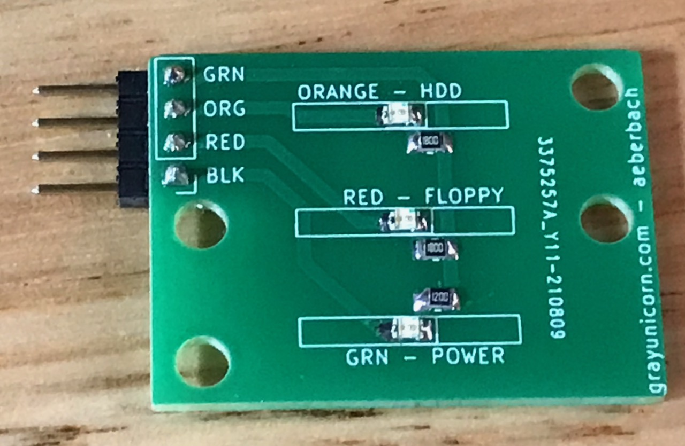
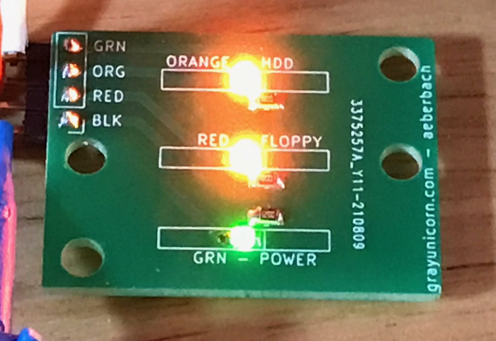
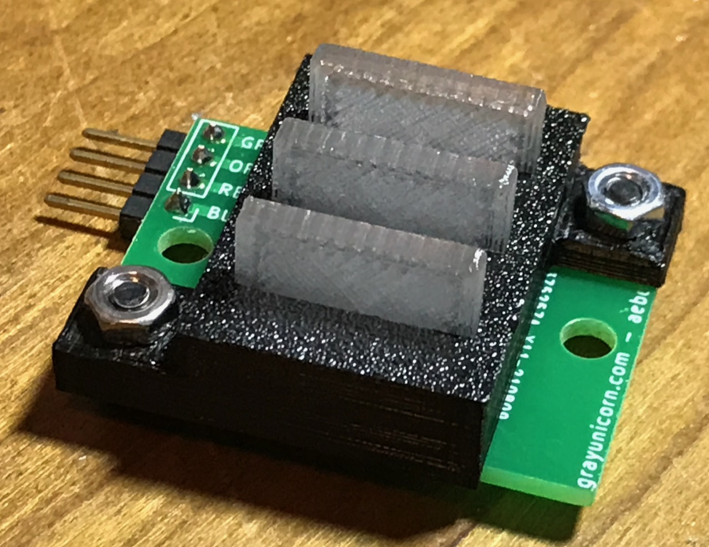
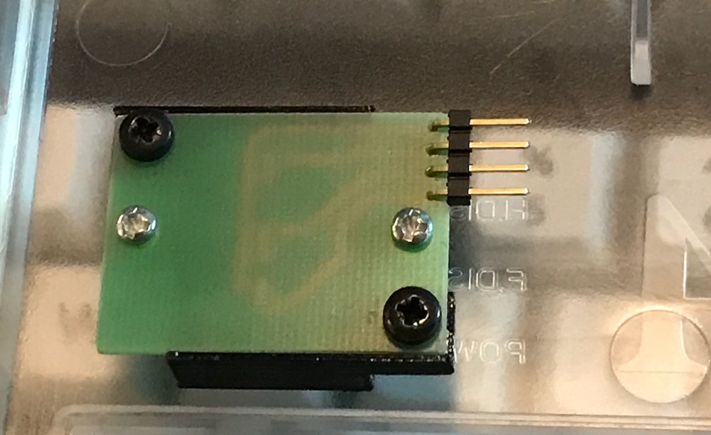
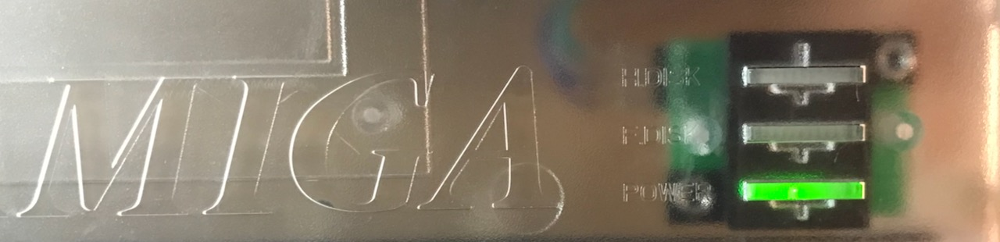
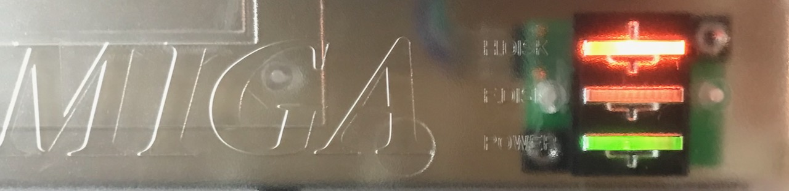

# Amiga 1200 LED assembly

I am far from the first person to make a new A1200 LED board. 

As I built a ReAmiga 1.5 I needed an extra LED board. I could have bought one but making something like this was a pretty good way to end a day of meetings and boring maintenance programming. 

The original used a rectangular lens with a pair of LEDs at its base. I've seen a single LED illuminating a light pipe, also a line of rectangular LEDs with no light pipe. I decided to try 3D printed light pipes.

I have a roll of transparent Prusament PETG. When printed it comes out looking like an ice cube due to all the layer boundaries. The transparent A1200.net case I want to use means this transparent filament is a good match when making mounts for my keyboard and other parts. I found the direction of print really matters - If printed standing "up" then the light does not cross the lines of printing all that well and the LED is dim. If printed flat then the layers transmit light well and the LED is bright.

While the A1200.net case is patterned on later model A1200 cases and uses 15mm rectangular holes for the LEDs, older A1200 cases used 14mm LED holes. It would maybe be possible to print light pipe pieces so that they could be turned over, with 14mm one side and 15mm the other? I have just made two versions for now.

The opaque plastic base aligns and holds the translucent pieces, and blocks the light from crossing from one LED to an adjacent one. There is a recess to allow the SMD component to fit under the translucent pieces. 

PCB manufacture was by JLCPCB. Shipping is by far the most expensive part of this project. I'm using the most economical LEDs I could find on Mouser in 0805 size, the smallest I like to solder by hand. They drop 2.2V and have a maximum current of 20mA. I targeted 15mA and settled on a 180 ohm resistor. Because the green LED is far less bright I used a 120 
ohm resistor there.

Another thing I did was use a 4-pin right angled header instead of soldering wire direct to the PCB. Whenever I have removed an A1200 cover I have not liked the dangling wire. Sometimes I forget it's there and yank the wire. These wire connections break. Also I don't love soldering ordinary PVC-insulated wire to PCBs as the insulation melts and shrinks back. It would be nice to have rolls of PTFE-insulated cable in the right size and color at hand but that's expensive. Instead I made a cable connecting the 5-position mainboard end to the 4-position LED board end. There isn't room to use 5 positions on the board end. 

So how does it look?

I'm happy with that. 

If you want one it may be worth asking me if you're local. If you're not then just buy one from your closest store, many places sell a similar thing and if this is all you're buying the postage might be the biggest cost.